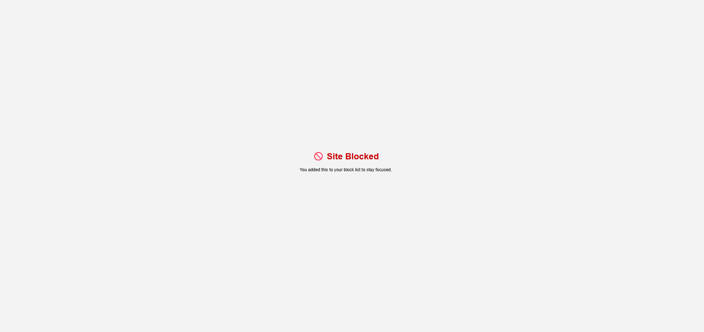

# Procastinator Blocker

## Features

Main goal of this extension is stop wasting time in social media, posts sites, xxx sites, etc. Included features:

- Website blocker by domain name
- Redirect to a custom page after trying access to a blocked website

## Tech Stack

Its using js/html extension builder to create features on this extension.

## Installation

Clone repo, go to "Manage extension" settings page, activate Developer mode, click on "Load Unpacked", select extension folder.

## Usage

On extension options page you are allowed to add and remove websites to block, you can add any web url to restinct their access, url must not include http/https extensions, only domains are allowed.

## License

MIT License